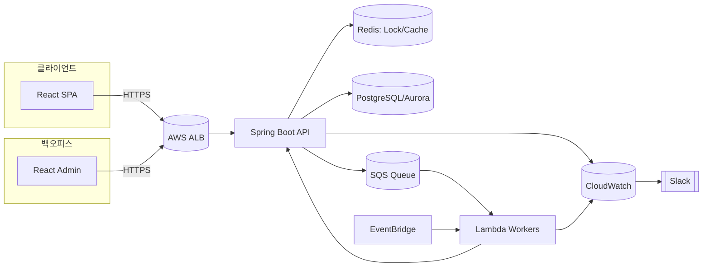

# 설계 다이어그램

다음은 클라이언트/백오피스/백엔드/인프라 전반을 포함한 개략도입니다.

참고: 도메인 모델/스키마는 도메인/구현 섹션의 ERD 문서를 함께 보세요.

## 주요 설계 포인트
- 좌석 선점/예매: Redis 기반 분산 락(또는 원자적 연산)과 트랜잭션 조합
- 동적 트래픽 제어: 백오피스에서 Rate Limit/캐시 파라미터 변경 → API에 반영
- 비동기 처리: SQS/Lambda를 통한 지연 허용 작업(알림/정산/집계)

## 학습 포인트
- 병목지점(데이터베이스/락/네트워크)의 파악과 제어 지점 설계
- 동기 API + 비동기 파이프라인의 경계 정의
- 관측가능성(Observability)을 고려한 지표/로그/알람 설계

## 실습 과제
- 예매 플로우 시퀀스 다이어그램 작성 (성공/실패/타임아웃)
- Redis 락 해제 누락/오버셀 방지 시나리오별 대책표 정리
- 백오피스 → 동적 설정 갱신 → API 반영 플로우 상세화
