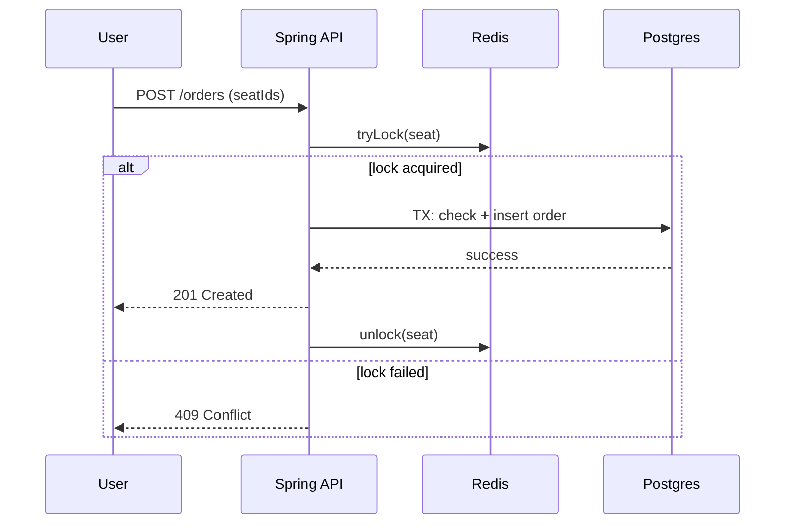

# 백엔드 API 설계

## 모듈/레이어
- API (Controller) → Service → Repository(JPA)
- Infra: Redis(락/캐시), 메시징(SQS), 외부 알림(Slack Webhook)
- 보안: JWT/세션, RBAC(관리자 권한)

## 주요 엔드포인트(초안)
```http
GET    /api/v1/events
GET    /api/v1/events/{id}
POST   /api/v1/orders            # 좌석 선점/주문 생성
GET    /api/v1/orders/{id}
DELETE /api/v1/orders/{id}       # 예매 취소

# Admin
GET    /api/v1/admin/metrics
POST   /api/v1/admin/config      # RateLimit/Cache 등 동적설정 갱신
POST   /api/v1/admin/users       # 권한/역할 관리
```

## 좌석 선점/예매 동시성 제어
- Redis 분산 락(좌석 단위 키) + DB 트랜잭션으로 오버셀 방지
- 타임아웃/락 해제 보장(만료/Finally 처리)

### 의사코드
```java
String key = "seat:lock:" + seatId;
boolean locked = redis.tryLock(key, ttl=5s);
if (!locked) throw new Conflict("Seat locked");
try {
  if (orderRepository.existsBySeatAndEvent(seatId, eventId)) {
    throw new Conflict("Already sold");
  }
  // 재고/상태 검증 → 주문 생성 (TX)
  orderService.createOrder(userId, eventId, seatId);
} finally {
  redis.unlock(key);
}
```

### 시퀀스 다이어그램


## 동적 설정(Dynamic Config)
- 관리자가 백오피스에서 변경 → 설정 스토어(예: Redis Hash/DB) → API 부트스트랩/리프레시
- 예: `rate.limit.perMinute`, `cache.ttl.eventList`

## 학습 포인트
- 분산 락 vs 원자적 업데이트(SETNX/INCR) 선택 기준
- DB 격리수준/인덱싱/Deadlock 회피 전략
- 구성 변경의 일관성(강/약 일관성) 고려

## 실습 과제
- 단일 좌석에 대한 동시성 테스트(멀티스레드) 작성
- RateLimit 미들웨어(필터/인터셉터) 시제품 구현
- OpenAPI → Controller/DTO 스켈레톤 코드 생성
