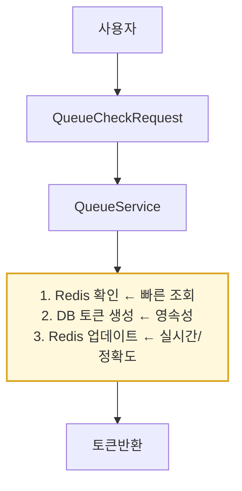
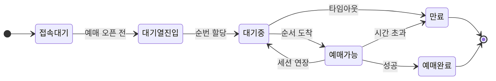

# 티켓팅 시스템 대기열(Queue)

## 개요

티켓팅 시스템에서 **동시 접속 제어**와 **서버 안정성**을 위해 구현된 대기열 시스템
- 동시 접속하는 상황에서도 안정적인 작동과 서버 과부하를 방지하는 것을 목표
-  **오버부킹 + Redis 세션 관리 + Heartbeat 시스템**의 조합으로 최적의 사용자 경험을 제공.
---

## 전체 아키텍처

### 기술 스택

- **Backend**: Spring Boot + Redis + PostgreSQL
- **Session Management**: Redis (분산 세션 관리)
- **Queue Management**: Database + Redis 하이브리드
- **Real-time Communication**: REST API + Heartbeat

### 시스템 플로우

```

1. 사용자 접속 → 2. 대기열 필요성 확인 → 3. 토큰 발급/바로 진입
4. 대기열 대기 → 5. 순서 도달 → 6. 예매 진행 → 7. 토큰 사용 완료

```
### 대기열 확인 플로우

### 전체 예매 플로우

```
1. 사용자 접속
   ↓
2. 대기열 진입 API 호출
   ↓
3-A. 바로 활성화 (동시 접속자 < 임계값)
   ↓
   예매 진행

3-B. 대기열 대기 (동시 접속자 ≥ 임계값)
   ↓
4. 주기적으로 상태 체크 (폴링)
   ↓
5. 활성화 알림 수신
   ↓
6. 예매 진행 (제한 시간 내)
   ↓
7. 예매 완료 or 시간 초과
```





---

##  핵심 기술 구현

### 1. **오버부킹(Overbooking)**

실제 처리 가능량보다 더 많은 사용자를 동시에 받아들임

```yaml
# application.yml
queue:
  max-active-tokens: 20        # 기본 동시 처리량
  overbooking-ratio: 1.5       # 50% 오버부킹 (30명까지 동시 처리)

```

**백엔드 로직**:

```java
private int getMaxConcurrentSessions() {
    return (int) (maxActiveTokens * overbookingRatio);  // 20 * 1.5 = 30
}

```

- 일부 사용자가 중도 이탈해도 서버 리소스를 최대한 활용
- 대기시간 단축 효과

### 2. **Redis 기반 실시간 세션 관리**

**세션 추적**:

```java
// 활성 세션 수 체크
String sessionKey = "active_sessions:" + performanceId + ":" + scheduleId;
int activeSessions = redisTemplate.opsForValue().get(sessionKey);

if (activeSessions < maxConcurrentSessions) {
    // 바로 진입 허용
    redisTemplate.opsForValue().increment(sessionKey);
    return "바로 예매 가능";
} else {
    // 대기열 필요
    return "대기열 진입";
}

```

### 3. **Heartbeat 시스템**
```markdown
[클라이언트] ────────────── [서버]

1. 페이지 접속
   │
   ├─ checkQueueRequirement()
   └─ startHeartbeat() ──────► Redis: heartbeat:123:1:1 = "2024-01-01T10:00:00"
                              (TTL: 120초)

2. 30초마다 heartbeat 전송
   │
   ├─ POST /api/v1/queue/heartbeat
   │  { "performanceId": 1, "scheduleId": 1 }
   │
   └─ updateHeartbeat() ─────► Redis: heartbeat:123:1:1 = "2024-01-01T10:00:30"
                              (TTL 갱신: 120초)

3. 사용자가 2분간 비활성
   │
   ├─ Redis TTL 만료 또는
   ├─ 스케줄러가 오래된 heartbeat 발견
   │
   └─ processTimeout() ──────► releaseSession()
                              ├─ DB: 토큰 만료 처리
                              ├─ Redis: 활성 토큰 수 감소
                              └─ activateNextTokens(): 다음 대기자 활성화

```

**비활성 사용자 자동 정리**:

```java
// 30초마다 heartbeat 전송
@PostMapping("/heartbeat")
public void updateHeartbeat(Long userId, Long performanceId) {
    String heartbeatKey = "heartbeat:" + userId + ":" + performanceId;
    redisTemplate.opsForValue().set(heartbeatKey,
        LocalDateTime.now().toString(),
        Duration.ofMinutes(2)); // 2분간 유효
}

```

**자동 정리 스케줄러**:

```java
@Scheduled(fixedRate = 60000) // 1분마다 실행
public void cleanupInactiveSessions() {
    // heartbeat가 없는 사용자의 세션 해제
    // → 다음 대기자가 자동으로 진입
}

```
## Trouble Shooting

티케팅 시스템에서 인기 공연의 예매 오픈 시점에 수만 명의 사용자가 동시 접속하면서 서버 과부하와 응답 지연이 발생. 기존 단순한 동시성 제어로는 서버 안정성을 보장할 수 없었고, 사용자들이 무한 로딩에 빠지거나 예매 기회를 놓치는 문제가 반복되는 상황.

## 해결 방안

Redis 기반 분산 락과 대기열 시스템을 구축하여 동시 접속자 수를 제어하고, 오버부킹 전략으로 서버 리소스 활용,  Spring Boot와 Redis를 활용해 실시간 세션 관리와 Heartbeat 시스템로 구현함.

---

## 프론트엔드 구현

### 1. **대기열 진입 플로우**

### Step 1: 대기열 필요성 확인

```jsx
// 예매 버튼 클릭 시
const checkQueue = async (performanceId, scheduleId) => {
    const response = await fetch('/api/v1/queue/check', {
        method: 'POST',
        headers: {
            'Authorization': `Bearer ${token}`,
            'Content-Type': 'application/json'
        },
        body: JSON.stringify({ performanceId, scheduleId })
    });

    const result = await response.json();

    if (result.data.canProceedDirectly) {
        // 바로 좌석 선택 페이지로 이동
        window.location.href = `/seats/${scheduleId}`;
    } else {
        // 대기열 토큰 발급
        await issueQueueToken(performanceId);
    }
};

```

### Step 2: 토큰 발급 및 대기

```jsx
const issueQueueToken = async (performanceId) => {
    const response = await fetch('/api/v1/queue/token', {
        method: 'POST',
        headers: {
            'Authorization': `Bearer ${token}`,
            'Content-Type': 'application/json'
        },
        body: JSON.stringify({ performanceId })
    });

    const result = await response.json();
    const queueToken = result.data.token;

    // 대기열 페이지로 이동
    showQueueWaitingPage(queueToken);
};

```

### 2. **대기열 대기 페이지 구현**

### 실시간 상태 업데이트

```jsx
const startQueuePolling = (token) => {
    const pollInterval = setInterval(async () => {
        try {
            const response = await fetch(`/api/v1/queue/status/${token}`);
            const result = await response.json();
            const status = result.data;

            // UI 업데이트
            updateQueueUI(status);

            // 예매 가능 상태가 되면
            if (status.isActiveForBooking) {
                clearInterval(pollInterval);
                stopHeartbeat();
                proceedToBooking();
            }
        } catch (error) {
            console.error('Queue status check failed:', error);
        }
    }, 3000); // 3초마다 상태 확인

    return pollInterval;
};

const updateQueueUI = (status) => {
    document.getElementById('queue-position').textContent = status.positionInQueue;
    document.getElementById('estimated-wait').textContent =
        `약 ${status.estimatedWaitTime}분`;

    // 진행률 바 업데이트
    const progress = Math.max(0, 100 - (status.positionInQueue * 2));
    document.getElementById('progress-bar').style.width = `${progress}%`;
};

```

### 3. **Heartbeat 구현**

```jsx
let heartbeatInterval;

const startHeartbeat = (performanceId, scheduleId) => {
    heartbeatInterval = setInterval(async () => {
        try {
            await fetch('/api/v1/queue/heartbeat', {
                method: 'POST',
                headers: {
                    'Authorization': `Bearer ${token}`,
                    'Content-Type': 'application/json'
                },
                body: JSON.stringify({ performanceId, scheduleId })
            });
        } catch (error) {
            console.error('Heartbeat failed:', error);
        }
    }, 30000); // 30초마다 전송
};

const stopHeartbeat = () => {
    if (heartbeatInterval) {
        clearInterval(heartbeatInterval);
    }
};

```

### 4. **페이지 이탈 시 세션 정리**
beforeunload가 감지하는 경우
1. 브라우저/탭 닫기 (X 버튼)
2. 뒤로 가기 (← 버튼)
3. 앞으로가기(→ 버튼)
3. 새로 고침 (F5, Ctrl+R)
4. 주소창에 다른 URL 입력 후 이동 (엔터)
5. 링크 클릭으로 다른 페이지 이동

```jsx
// 페이지 떠날 때 세션 해제
window.addEventListener('beforeunload', (event) => {
    // Beacon API 사용 (페이지 종료 시에도 확실히 전송)
    if (navigator.sendBeacon) {
        const data = JSON.stringify({
            performanceId,
            scheduleId,
            reason: 'page_unload'
        });

        navigator.sendBeacon('/api/v1/queue/release-session', data);
    }
});

// 뒤로가기 버튼 처리
const handleBackButton = async () => {
    await fetch('/api/v1/queue/release-session', {
        method: 'POST',
        headers: {
            'Authorization': `Bearer ${token}`,
            'Content-Type': 'application/json'
        },
        body: JSON.stringify({ performanceId, scheduleId })
    });

    history.back();
};

```

---

##  백엔드 핵심 로직

### 1. **대기열 상태 관리**

```java
@Service
public class QueueService {

    // 대기열 필요성 판단
    public QueueCheckResponse checkQueueRequirement(Long performanceId, Long scheduleId, Long userId) {
        String sessionKey = "active_sessions:" + performanceId + ":" + scheduleId;
        int activeSessions = getCurrentActiveSessions(sessionKey);
        int maxSessions = getMaxConcurrentSessions();

        if (activeSessions < maxSessions) {
            // 오버부킹 범위 내에서 바로 진입 허용
            incrementActiveSession(sessionKey);
            startHeartbeatTracking(userId, performanceId, scheduleId);

            return QueueCheckResponse.builder()
                .canProceedDirectly(true)
                .sessionId(UUID.randomUUID().toString())
                .build();
        } else {
            // 대기열 필요
            int waitingCount = getCurrentWaitingCount(performanceId);

            return QueueCheckResponse.builder()
                .requiresQueue(true)
                .currentWaitingCount(waitingCount)
                .estimatedWaitTime(waitingCount * 30) // 1인당 30초 예상
                .build();
        }
    }
}

```

### 2. **자동 대기열 진행**

```java
@Scheduled(fixedRate = 30000) // 30초마다 실행
public void processQueue() {
    List<Performance> performances = performanceRepository.findAll();

    for (Performance performance : performances) {
        // 만료된 토큰 정리
        cleanupExpiredTokens(performance);

        // 다음 대기자들 활성화
        activateNextTokens(performance);

        // 대기열 순서 업데이트
        updateWaitingQueuePositions(performance);
    }
}

private void activateNextTokens(Performance performance) {
    Long activeCount = queueTokenRepository.countActiveTokensByPerformance(performance);
    int maxSessions = getMaxConcurrentSessions();

    if (activeCount < maxSessions) {
        int tokensToActivate = maxSessions - activeCount.intValue();

        List<QueueToken> waitingTokens = queueTokenRepository
            .findTokensToActivate(performance);

        waitingTokens.stream()
            .limit(tokensToActivate)
            .forEach(token -> {
                token.activate(); // 토큰 활성화
                log.info("토큰 활성화: {} (오버부킹 적용)", token.getToken());
            });
    }
}

```

### 3. **비활성 세션 자동 정리**

```java
@Scheduled(fixedRate = 60000) // 1분마다
public void cleanupInactiveSessions() {
    try {
        // heartbeat가 2분 이상 없는 세션들 찾기
        LocalDateTime cutoff = LocalDateTime.now().minusMinutes(2);

        // Redis에서 만료된 heartbeat 키들 확인
        Set<String> expiredSessions = findExpiredHeartbeats();

        for (String sessionKey : expiredSessions) {
            // 해당 사용자의 세션 강제 해제
            releaseInactiveSession(sessionKey);

            // 다음 대기자 자동 진입
            activateNextWaitingUser();
        }
    } catch (Exception e) {
        log.error("비활성 세션 정리 중 오류 발생", e);
    }
}

```

---

## 모니터링 및 관리

### 관리자용 대시보드 API

```java
@GetMapping("/admin/queue/stats")
public List<QueueStatsResponse> getQueueStats() {
    return queueService.getQueueStatsByPerformance();
}

// 응답 예시
[
    {
        "performanceId": 1,
        "performanceTitle": "BTS 월드투어",
        "waitingCount": 1250,
        "activeCount": 30,
        "usedCount": 180,
        "averageWaitTimeMinutes": 42
    }
]

```

### 실시간 대기열 현황

```jsx
const fetchQueueStats = async () => {
    const response = await fetch('/admin/api/queue/stats');
    const stats = await response.json();

    stats.forEach(stat => {
        console.log(`${stat.performanceTitle}: 대기 ${stat.waitingCount}명, 활성 ${stat.activeCount}명`);
    });
};

```

---

##  핵심 장점

### 1. **서버 안정성**

- 동시 접속자 수를 제어하여 서버 과부하 방지
- 오버부킹으로 리소스 활용도 극대화

### 2. **사용자 경험**

- 명확한 대기 순서와 예상 시간 제공
- 실시간 상태 업데이트로 투명성 확보

### 3. **확장성**

- Redis 클러스터링으로 수평 확장 가능
- 마이크로서비스 아키텍처 대응

### 4. **신뢰성**

- 자동 세션 정리로 무한 대기 방지
- Heartbeat 시스템으로 정확한 활성 사용자 추적

---

##  테스트 시나리오

### 기본 플로우 테스트

```bash
# 1. 로그인
POST /auth/login
{
    "usernameOrEmail": "testuser",
    "password": "password123"
}

# 2. 대기열 확인
POST /api/v1/queue/check
{
    "performanceId": 1,
    "scheduleId": 1
}

# 3. 토큰 발급 (대기열 필요 시)
POST /api/v1/queue/token
{
    "performanceId": 1
}

# 4. 상태 확인 (반복)
GET /api/v1/queue/status/{token}

# 5. 예매 진행 (활성화 시)
POST /v1/bookings
{
    "scheduleId": 1,
    "seatIds": [1, 2],
    "queueToken": "{token}"
}

```

---

## 이후 개선 사항
- **WebSocket 도입**: 실시간 알림 및 상태 업데이트 개선
- **장애 복구 시나리오**: 시스템 장애 시 대기열 상태 복구 방안 마련